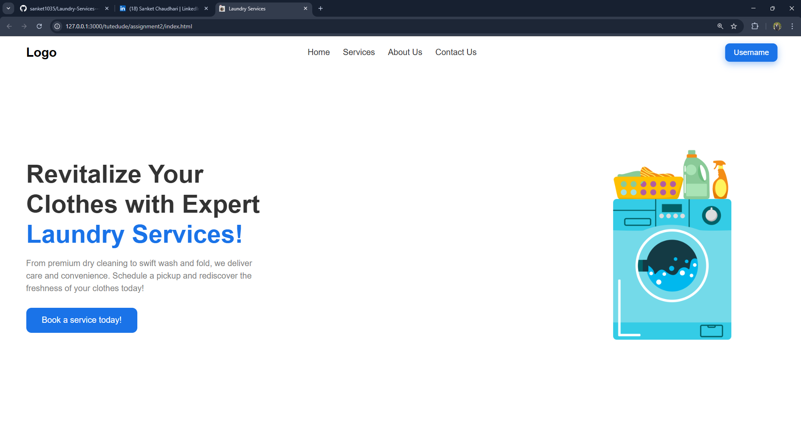

# Laundry Services - Hero Section

## 📌 Project Overview
This project is **Assignment 2** for creating the **Hero Section** of a Laundry Services web application.  
It includes a **navigation bar**, a visually appealing **hero section**, animations, and a responsive layout using HTML and CSS.

The design focuses on:
- Clean, modern look
- Viewport-based layout (fits on one screen without scrolling)
- Smooth animations for better user experience

---

## ✨ Features
- **Navigation Bar** with:
  - Logo (left)
  - Links: Home, Services, About Us, Contact Us (center)
  - Username button with hover animation (right)
- **Hero Section**:
  - Left: Heading, description, and CTA button
  - Right: Laundry-related image
- **Animations**:
  - Navbar fade-in effect on page load
  - Underline animation on nav link hover
  - Button hover effects with scaling and color change
- Fully responsive and clean UI

---

## 🖼 Screenshot
  
*(Replace `screenshot.png` with your actual screenshot if needed)*

---

## 📂 File Structure
```
├── index.html        # Main HTML file
├── style.css         # Styling and animations
├── img.png           # Laundry-related image
├── favicon.ico       # Website favicon
└── README.md         # Project documentation
```

---

## 🚀 How to Run Locally
1. **Clone the Repository**:
   ```bash
   git clone https://github.com/yourusername/laundry-hero-section.git
   ```
2. **Open the Project**:
   - Navigate to the project folder
   - Open `index.html` in your browser

---

## 🌐 Deployment
This project is deployed on **Netlify**.  
🔗 **Live Demo:** [Click Here](https://your-netlify-link.netlify.app)

---

## 🛠 Technologies Used
- **HTML5**
- **CSS3**
- **Flexbox**
- **Viewport Units (vh, vw)**
- **CSS Animations**

---

## 📜 License
This project is licensed for educational purposes only.  
Feel free to use and modify for learning.

---

## 👨‍💻 Author
**Your Name**  
- GitHub: [Your GitHub](https://github.com/sanket1035)  
- LinkedIn: [Your LinkedIn](https://linkedin.com/in/sanketchaudhari1035/)  
